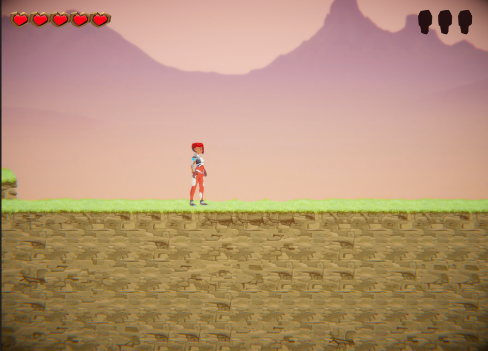
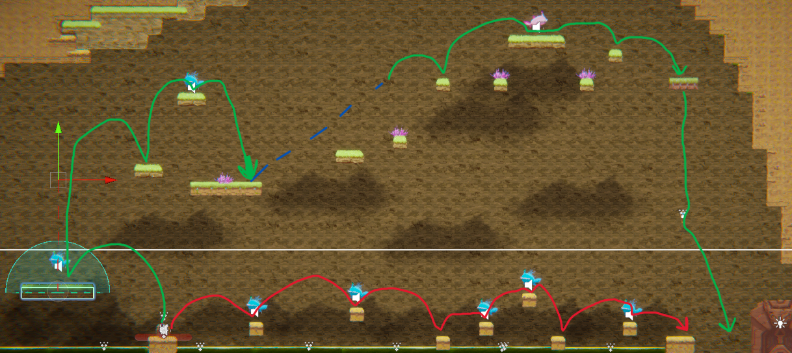
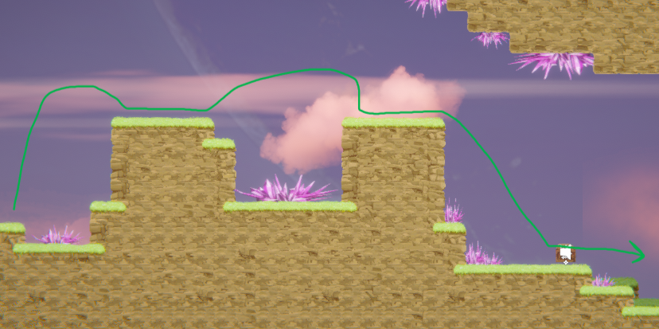
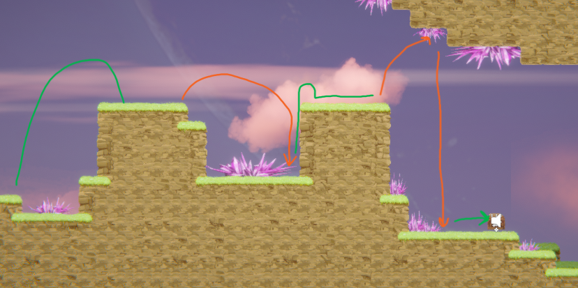
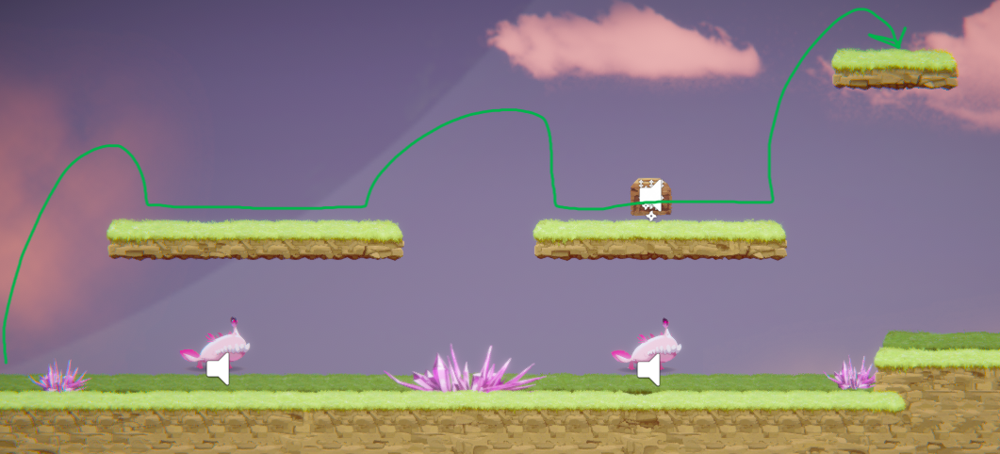
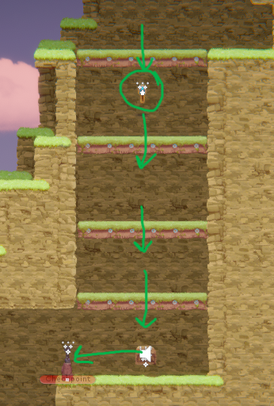
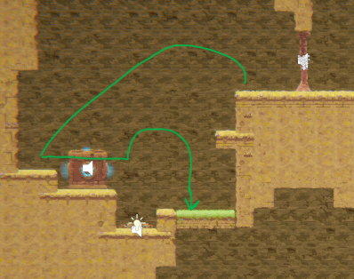
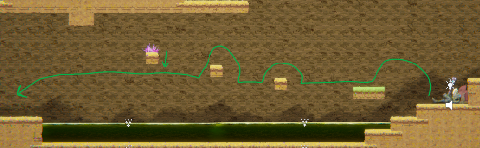
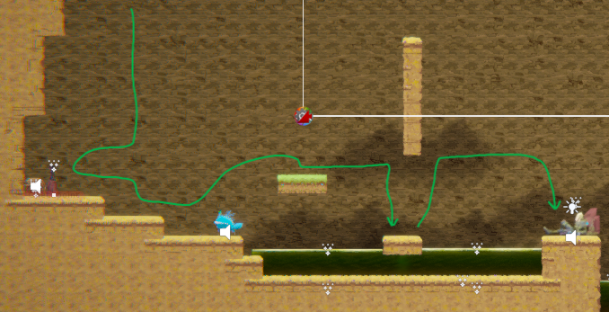
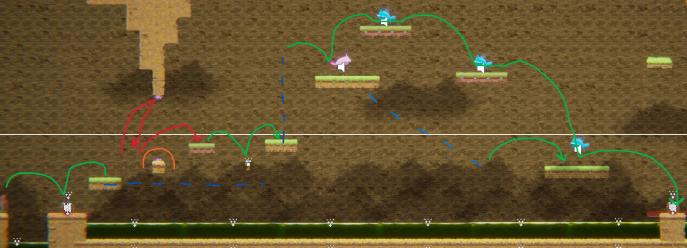

# COMP2150  - Level Design Document
### Name: Yuyang Su
### Student number: 47397713

## 1. Player Experience (~700 words)
In this game design task, the goal is to design 3 sections for a 2d action platformer centered around player experience.
The goal of the game is to collect 3 keys to unlock a door that progresses to the next level. The core experience of the game revolves around elements that challenge the player, leading to a mastery of game mechanics necessary to progress the game.

### 1.1. Discovery
As the player loads in for the first time, they're able to easily grasps the basic movements of the game as they're likely to have past experiences with platformers. They learn that 'A' & 'D' both move the character left and right respectively, 'S' makes the character crouch, and that 'Spacebar' is the jump button. Players are able to learn the verbs of this game through playful experimentation and previous experiences of similar games.

The level is designed to have progressive complexity, so that the concept of hill climbing is present in the level design. This allows players to gradually familiarise themselves and gain mastery in movement mechanics before the more challenging elements are introduced.

The mechanic of falling through a platform is later introduced, the idea behind the player's discovery is that they'll be led to a dead-end with no other way to advance except by falling through a platform. By having a key be visible under the platform, players have an incentive to experiment with the controls driven by curiosity of the item under the platform.

I placed the staff/weapon pickups in spots with acid or enemies nearby. This contributes to discovery as environmental storytelling, players will piece together information (visuals) and come to a conclusion that acid (or enemies) are dangerous. The pickups contributes to progression by unlocking the ability to swing a staff or shoot a gun at enemies or breakable walls, and as the level progresses, players will discover dynamics like shooting while crouching, jumping, falling, or while moving.

### 1.2. Drama
The level starts off safe to allow players to get used to controls, but ramps up in difficulty as the level progresses. Section 1 contains simple jumps to allow players to master movement. The pacing is slow, players go at their own pace and invokes feelings of security while they get used to the controls. Part 2 of Section 1 adds spikes to the jumps for increased difficulty to improve flow, this creates drama however it's still safe as there isn't much risk.

Section 2 is when the level introduces hostile enemies and acid. These add increased difficulty and to remove the feeling of security and replacing it with tension. The introduction of moving platforms in this section changes the pace and players will have to time thier jumps now.

There is a small window of relief at the end of section 2, this allows players to rest up before taking on section 3.

Section 3 is where the climax of the dramatic arc resides. This section ramps up the difficulty by placing combinations of all the previous challenges, increasing the feelings of tension with well timed skill jumps, increased number of enemies, and acid pools at the bottom to send the player back to a previous checkpoint if they fail a jump.
There are 2 ways to reach the door, but only one of the ways lead to the final key. If players take the top path they can skip the skill jumps with spitters and obtain the key while falling, but if they take the bottom path the first time they'll see the key but have to backtract to obtain it. The top path contains timed skill jumps for rising action and the fall is the resolution while the bottom path is constant action with the spitters but players will realise that they have to backtract to obtain the final key. There are also healing checkpoints at safe spots in the section for moments of relief from the increased difficulty, I didn't include a checkpoint at the end so that players who take the bottom path can respawn to the checkpoint that splits the 2 paths.

### 1.3. Challenge
The level is designed with a hill climb design principle, starts safe and gradually ramps the difficulty. Section 1 has basic skill jumps to traverse terrain and avoid spikes. Section 2 has enemies to avoid, and acid as a more dangerous environment hazard than spikes, section 2 isn't designed to be difficult but to allow players to experience new enemy types and hazards before they're used in more challenging scenarios of section 3. Section 3 increases the difficulty and the skill required of the player, this modulated increase in difficulty is used to maintain flow.

### 1.4. Exploration
How does your level design facilitate autonomy and invite the player to explore? How do your aesthetic and layout choices create distinct and memorable spaces and/or places?

There is a bit of environmental storytelling in the level, the staff pickup is close to an acid pool and 2 chompers. It's placed after the chompers so that players can find out that chompers are hostile first and then provide a means to defend themselves. The placement of the staff pickup also hints towards the chomper's hostility (person holding the staff tries to run away from the chompers but is cornered by the acid).

Section 3 has split pathing, top path and bottom path. The top is mandatory for obtaining the final key and the bottom is optional to explore and provides challenge to the player but the reward for a frustrating path is frustration as they'll find that the final key can't be reached from the bottom path (but visible). If the player takes the bottom path first, they'll have an idea of where to drop for the final key when they take the top path as the key isn't visible from the top path.

## 2. Core Gameplay (~400 words)
A section on Core Gameplay, where storyboards are used to outline how you introduce the player to each of the required gameplay elements in the first section of the game. Storyboards should follow the format provided in lectures.

Storyboards can be combined when multiple mechanics are introduced within a single encounter. Each section should include a sentence or two to briefly justify why you chose to introduce the mechanic/s to the player in that sequence.

### 2.1. Spikes

Spikes are introduced to add a bit of challenge to the first section of the game, it's not that dangerous so it allows the player to get accustomed to the controls as they navigate past the spikes.

### 2.2. Health Pickups

Health pickups are introduced past the spike section as players are likely to have taken a bit of damage. The placement of the health pickups in the first section of the game allows players to recognise good item pickups by their blue glow.

### 2.3. Chompers

Introduces the chompers in a relatively confined space as a potential enemy, players will skip over them but keep them in mind as they have no means of protecting themselves at this point in the game.

### 2.4. Passthrough Platforms

Passable platforms are introduced to the player at the end of section 1. Players are forced to experiment with controls due to having no other way forward, but it's also incentivised to go down as there's an item with a blue glow hinting at a beneficial item pickup. I added multiple platforms so that players don't have to worry about missing the key as they fall, they're able to pick it up whenever they'd like.

### 2.5. Keys

Introduced at the end of section 1. Players are already familiar with blue glows being beneficial so they'll want to pick it up to see what it does.

### 2.6. Checkpoints

Introduced at the start of section 2. It's before acid is introduced so players can respawn here instead of the start of section 1, a safe zone to skip past content.

### 2.7. Weapon Pickup (Staff)

Introduced past 2 hostile chompers, players can wack them now. The staff is a neccessary item to break an upcoming wall and unlock progression.

### 2.8. Acid

Introduced mid section 2, more dangerous than spikes and must be traversed by moving platform.

### 2.9. Moving Platforms

Moving platforms are introduced mid section 2 to help players get accross pools of acid. There is a basic skill check here. Jump, Jump, Crouch. I made this platform faster than the others because the pool's length is longer, and it's only one platform travelling a straight line from start to end.

### 2.10. Spitters

Introduced at the start of section 3. They spit at the player character with a long distance attack, lets the player know that long distance attacks are present in the game.

### 2.11. Weapon Pickup (Gun)

Introduced after the first spitter, a gun can attack over a long distance. It will help against the many enemies in section 3.

## 3. Spatiotemporal Design
A section on Spatiotemporal Design, which includes your molecule diagram and annotated level maps (one for each main section of your level). These diagrams may be made digitally or by hand, but must not be created from screenshots of your game. The annotated level maps should show the structure you intend to build, included game elements, and the path the player is expected to take through the level. Examples of these diagrams are included in the level design lectures.

No additional words are necessary for this section (any words should only be within your images/diagrams).

### 3.1. Molecule Diagram

### 3.2. Level Map – Section 1

### 3.3. Level Map – Section 2

### 3.4. Level Map – Section 3

## 4. Iterative Design (~400 words)
Reflect on how iterative design helped to improve your level. Additional prototypes and design artefacts should be included to demonstrate that you followed an iterative design process (e.g. pictures of paper prototypes, early grey-boxed maps, additional storyboards of later gameplay sequences, etc.). You can also use this section to justify design changes made in Unity after you drew your level design maps shown in section 3.

You should conclude by highlighting a specific example of an encounter, or another aspect of your level design, that could be improved through further iterative design.

## Lecture Slide Use Acknowledgement

### Tool Used: Lecture Slides

**Nature of Use** Finding relevant design theory.

**Additional Notes:** I used the lecture slides for my design principles and applied them to the game.
